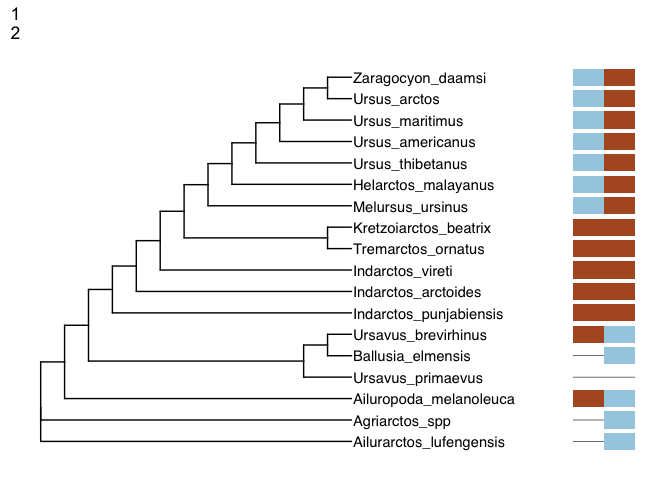
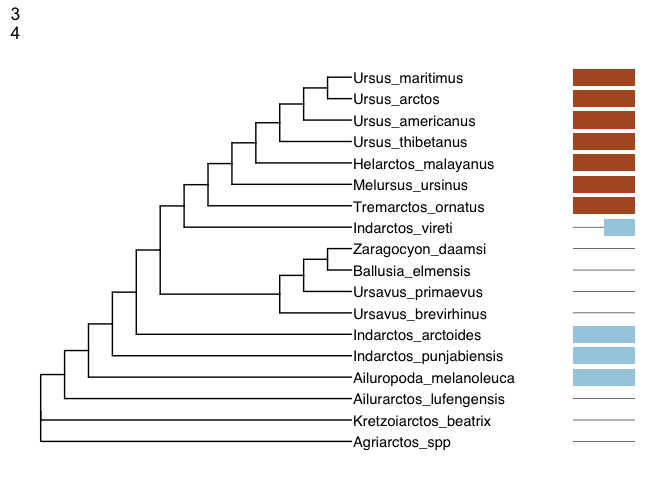
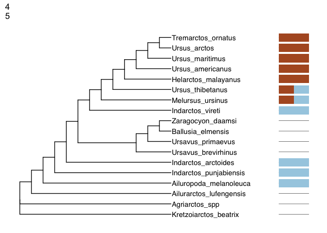
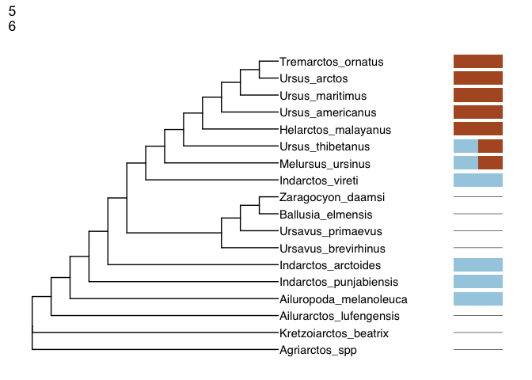

 [](https://travis-ci.org/wrightaprilm/treesiftr)
[](https://codecov.io/github/wrightaprilm/treesiftr?branch=master)

Introduction
------------

Estimating phylogenetic trees is crucial in many areas of evolutionary
biology. However, visualizing the relationship between data and trees is
not intutive. To assist with visualizing this relationship, I have
created [treesiftR](https://wrightaprilm.github.io/treesiftr/), an R
package (R Core Team 2018) that takes subsets of data from a
phylogenetic matrix, generates a tree under parsimony, and scores that
tree under both the likelihood and parsimony criteria. The output of the
package is a visualization or set of visualizations of a tree and
characters. Also included is a [Shiny
application](https://wrightaprilm.shinyapps.io/treesiftr_app/) (Chang et
al. 2018) that can be run locally or used via the web without installing
any R packages or having knowledge of R.

If you are interested in treesiftr, take a look at my [instructor’s
guide](https://wrightaprilm.github.io/treesiftr/articles/00-Instructor-Guide.html)
for more information (PDF also available
[here](https://github.com/wrightaprilm/treesiftr/blob/master/vignettes/00-Instuctor-Guide.pdf))
about adopting this module.

### Target Audience

treesiftr has been used in the [Analytical Paleobiology
Workshop](http://www.analytical.palaeobiology.de/), in which the
audience was graduate students and postdocs, many of whom had no prior
knowledge of phylogeny. It is also used in the Genetics course at
Southeastern Louisiana University, where the audience is undergraduates
who have no prior knowledge of phylogeny. It is meant to be accompanied
by lecture material on phylogenetics. A glossary is provided with each
worksheet, and a sample slide deck is included in the `inst/slides`
directory.

Installation
------------

Currently, treesiftr can be installed via the devtools `install_github`
function (Wickham, Hester, and Chang 2018).

``` r
devtools::install_github("wrightaprilm/treesiftr")
```

Required Packages
-----------------

``` r
knitr::opts_chunk$set(echo = TRUE)
library(ape)
library(treesiftr)
library(phangorn)
library(alignfigR)
```

    ## Welcome to alignfigR!

``` r
library(ggtree)
```

    ## ggtree v1.13.2  For help: https://guangchuangyu.github.io/software/ggtree
    ## 
    ## If you use ggtree in published research, please cite:
    ## Guangchuang Yu, David Smith, Huachen Zhu, Yi Guan, Tommy Tsan-Yuk Lam. ggtree: an R package for visualization and annotation of phylogenetic trees with their covariates and other associated data. Methods in Ecology and Evolution 2017, 8(1):28-36, doi:10.1111/2041-210X.12628

    ## 
    ## Attaching package: 'ggtree'

    ## The following object is masked from 'package:ape':
    ## 
    ##     rotate

``` r
library(ggplot2)
```

Operation
---------

The first step to making a treesiftr visualization is to select the
subset of the phylogenetic matrix that we would like to visualize. This
is performed via a function called `generate_sliding`. The below command
will subset the

``` r
# Locate package data
fdir <- system.file("extdata", package = "treesiftr")
aln_path <- file.path(fdir, "bears_fasta.fa")
bears <- read_alignment(aln_path)
tree <- read.tree(file.path(fdir, "starting_tree.tre"))

sample_df <- generate_sliding(bears, start_char = 1, stop_char = 10, steps = 1)

# Generate our list of dataframe subsets
sample_df <- generate_sliding(bears, start_char = 1, stop_char = 5, steps = 1)
```

The result of this is a dataframe, shown below:

``` r
sample_df
```

    ##   starting_val stop_val step_val
    ## 1            1        2        1
    ## 2            2        3        1
    ## 3            3        4        1
    ## 4            4        5        1
    ## 5            5        6        1

This dataframe dispays the start character (the first character that
will be visualized) and stop character (the final character that will be
visualized).

We can then build trees from each subset:

``` r
output_vector <- generate_tree_vis(sample_df = sample_df, alignment =                                                     aln_path, tree = tree, phy_mat = bears)
```

    ## Final p-score 2 after  0 nni operations 
    ## Final p-score 2 after  0 nni operations 
    ## Final p-score 2 after  0 nni operations 
    ## Final p-score 2 after  1 nni operations 
    ## Final p-score 2 after  1 nni operations

``` r
output_vector
```

    ## [[1]]



    ## 
    ## [[2]]


    ## 
    ## [[3]]



    ## 
    ## [[4]]



    ## 
    ## [[5]]



`Phangorn` (Schliep 2011, Schliep2017) requires a starting tree to
estimate a parsimony tree. We specify the tree we read in earlier for
this purpose. The trees, which were generated with `ggtree` (Yu et al.
2017), a ggplot2 (Wickham 2016) library for phylogenies, have been saved
to a vector, which can be displayed in its entirety, or subsetted to
look at specific trees.

## Random Trees

You can also map the characters to a random tree, and count the parsimony steps 
or score the characters under likelihood on this tree.

``` r
output_vector <- generate_tree_vis(sample_df = sample_df, alignment =                                                     aln_path, tree = tree, phy_mat = bears, 
                            random_tree = TRUE)
```

References
----------

Chang, Winston, Joe Cheng, JJ Allaire, Yihui Xie, and Jonathan
McPherson. 2018. *Shiny: Web Application Framework for R*.
<https://CRAN.R-project.org/package=shiny>.

R Core Team. 2018. *R: A Language and Environment for Statistical
Computing*. Vienna, Austria: R Foundation for Statistical Computing.
<https://www.R-project.org/>.

Schliep, K.P. 2011. “Phangorn: Phylogenetic Analysis in R.”
*Bioinformatics* 27 (4): 592–93.
<https://doi.org/10.1093/bioinformatics/btq706>.

Wickham, Hadley. 2016. *Ggplot2: Elegant Graphics for Data Analysis*.
Springer-Verlag New York. <http://ggplot2.org>.

Wickham, Hadley, Jim Hester, and Winston Chang. 2018. *Devtools: Tools
to Make Developing R Packages Easier*.
<https://CRAN.R-project.org/package=devtools>.

Yu, Guangchuang, David Smith, Huachen Zhu, Yi Guan, and Tommy Tsan-Yuk
Lam. 2017. “Ggtree: An R Package for Visualization and Annotation of
Phylogenetic Trees with Their Covariates and Other Associated Data.”
*Methods in Ecology and Evolution* 8 (1): 28–36.
<https://doi.org/10.1111/2041-210X.12628>.
